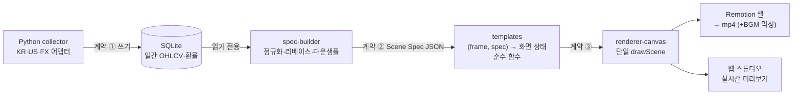

# hindsight

주식 수익률 변동을 애니메이션 영상으로 만들어 YouTube Shorts로 발행하는 개인용 로컬 툴.

티커 몇 개와 기간을 넣으면 "2020년, 1,000만원을 넣었다면?" 같은 세로형(1080×1920, 60fps, 약 40초)
라인 레이스 영상이 나온다. 훅 → 레이스(₩ 환산 카운터·종목 간 격차·완급 연출) → 결과 요약 정지 프레임.

- 한국/미국 주식·ETF 지원 (지수는 라이선스 문제로 추종 ETF 사용: S&P500→SPY, 나스닥100→QQQ)
- 수정주가(adjusted close) 기준 가격수익률 — 화면에 명시
- 한/미 휴장일 차이는 union 거래일 축 + forward-fill로 정렬, 리베이스 100

## 아키텍처

컴포넌트는 기능이 아니라 **계약 3개**로 자른다. 계약이 안정되면 양쪽 구현은 독립적으로 교체 가능하다.



- **계약 ① SQLite** — Python(collector)은 쓰기만, TypeScript는 읽기만. 언어 경계가 DB 파일 하나다.
- **계약 ② Scene Spec** — `specVersion`·`template`·공유 time 배열을 가진 JSON. 렌더러와의 유일한 계약.
- **계약 ③ 템플릿 인터페이스** — 연출 로직(easing·완급·카운터)은 전부 templates의 순수 함수에 있고,
  Remotion(mp4)과 웹 미리보기는 **같은 `drawScene`(Canvas 2D) 하나**를 공유한다.
  미리보기에서 본 것과 영상이 어긋날 수 없는 구조.

### 모노레포

| 경로 | 역할 |
| --- | --- |
| `data/collector/` | Python — 시장 어댑터(FDR 1차, yfinance 폴백) + SQLite 증분 적재 |
| `packages/scene-spec` | 계약 ②: zod 스키마 + 검증기 |
| `packages/spec-builder` | 정규화 → Scene Spec 생성 (순수 함수, I/O 없음) |
| `packages/templates` | 계약 ③: 템플릿 = 프레임 → 화면 상태 |
| `packages/renderer-canvas` | 단일 페인터 `drawScene` + 실시간 플레이어 |
| `packages/renderer-remotion` | Remotion 셸 (drawScene을 감싸 mp4로) |
| `apps/server` | 로컬 API(:4600) — Spec 생성, 렌더 잡 큐, BGM 목록 |
| `apps/worker` | 잡 큐 소비 → Remotion 렌더 → ffmpeg BGM 먹싱 |
| `apps/web` | 제작 스튜디오(:5173) — 입력 폼 + 실시간 미리보기 |
| `p0/` | matplotlib PoC — 연출 파라미터 확정용, 버릴 코드 |

## 시작하기

요구사항: Node 22+, pnpm 10(corepack), Python 3.11+, ffmpeg

```bash
pnpm install
python3 -m venv .venv
.venv/bin/pip install finance-datareader yfinance pandas matplotlib
.venv/bin/python3 scripts/make-placeholder-bgm.py   # (선택) 검증용 BGM 트랙 생성
```

### 개발 모드

```bash
pnpm server   # API 서버 :4600
pnpm queue    # 렌더 워커 (잡 큐 폴링)
pnpm web      # 웹 스튜디오 :5173 (/api는 서버로 프록시)
```

http://localhost:5173 에서 종목·기간·타이틀·맥락 한 줄을 넣고 **미리보기** → **렌더 (mp4)**.
부족한 시세 데이터는 서버가 collector를 호출해 자동 적재한다.

### docker

```bash
docker compose up   # server(:4600, 웹 포함) + worker
```

### CLI

```bash
.venv/bin/python3 data/collector/ingest.py 005930 NVDA USD/KRW   # 시세 적재 (증분)
pnpm render specs/golden_synthetic.json                           # Spec → mp4 (합성 픽스처)
pnpm studio                                                       # Remotion Studio
```

## BGM

`assets/bgm/`에 음원 파일(mp3/m4a/wav)을 넣으면 웹 스튜디오 드롭다운에 나타난다.
워커가 렌더 후 ffmpeg로 루프·페이드(인 0.8s / 아웃 2.5s) 먹싱한다.
발행용 음원은 **YouTube 오디오 보관함**(수익화 안전) 사용을 권장하며, 음원은 저장소에 커밋하지 않는다.

## 로드맵 (현재: P2 완료)

| 단계 | 범위 | 상태 |
| --- | --- | --- |
| P0 | matplotlib PoC — 연출 감각 확보 | ✅ |
| P1 | Scene Spec v1 + Remotion 파이프라인 | ✅ |
| P2 | collector + 웹 스튜디오 + 잡 큐 + docker | ✅ |
| P3 | 템플릿 3종(단일/라인 레이스/바 차트 레이스) + 메타 생성 | 예정 |
| P4 | YouTube 업로드 자동화 (OAuth 검증 통과 후) | 예정 |
| P5 | 모바일 뷰어 앱 + 공개 뷰어 API | 선택 |

설계 결정 기록(ADR)·단계별 실행 계획은 비공개 노션에서 관리한다.

## 주의

- 시세 데이터는 FinanceDataReader/yfinance 등 무료·비공식 소스다. 수익화 규모가 커지면
  상업 이용이 허용된 유료 소스로 전환한다 (어댑터 뒤에 숨겨둔 이유).
- Remotion은 개인·직원 3인 이하 조직은 상업 이용 포함 무료. 메이저 버전 업그레이드 시 라이선스 재확인.
- YouTube는 반복적·대량생산 콘텐츠를 수익화 불가로 분류한다 — 영상마다 맥락 한 줄(`contextLine`)이
  계약 수준에서 필수인 이유.
